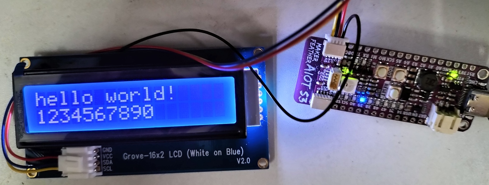

# esp32s3-ulp_RiscV-hello
This is a demo code for I2C LCD (AIP31068) for the ESP32S3 ULP RiscV using software I2C.

The simple code drives the I2C 16x2 LCD (usually sold as [Grove 16x2 LCD](https://my.cytron.io/p-grove-16-x-2-lcd-white-on-blue)) with the AIP31068 controller on the ESP32-S3's RiscV ULP.

The code has been tested on [Cytron's Maker Feather AIOT S3](https://my.cytron.io/p-v-maker-feather-aiot-s3-simplifying-aiot-with-esp32?r=1).

The hardware I2C for the ULP is not accessible on this board (see page **479** and **480** on [ESP32-S3 Technical Reference Manual](https://www.espressif.com/sites/default/files/documentation/esp32-s3_technical_reference_manual_en.pdf)), software I2C is used.

Software I2C routines by PascalPolygon: [STM32 Software I2C](https://github.com/PascalPolygon/stm32_bitbang_i2c), modified for the RiscV ULP.

Since the ULP's RTC GPIO is only coupled up to GPIO 21, the example is using GPIO 4 and 7 instead.

After programming the board, press Reset button to run the ULP program.

References:
- [ESP-IDF Example ULP RiscV GPIO](https://github.com/espressif/esp-idf/tree/db9586c53f31a65abf0a51cac7072d7750f7b073/examples/system/ulp_riscv/gpio)
- [STM32 Software I2C](https://github.com/PascalPolygon/stm32_bitbang_i2c)
- [AIP31068 Datasheet](https://support.newhavendisplay.com/hc/en-us/article_attachments/4414498095511/AiP31068.pdf)

Note: For [Cytron's Maker Feather AIOT S3](https://my.cytron.io/p-v-maker-feather-aiot-s3-simplifying-aiot-with-esp32?r=1) users using this SDK, please enable the GPIO11 first if you need to use the diagnostic LEDs on board!
